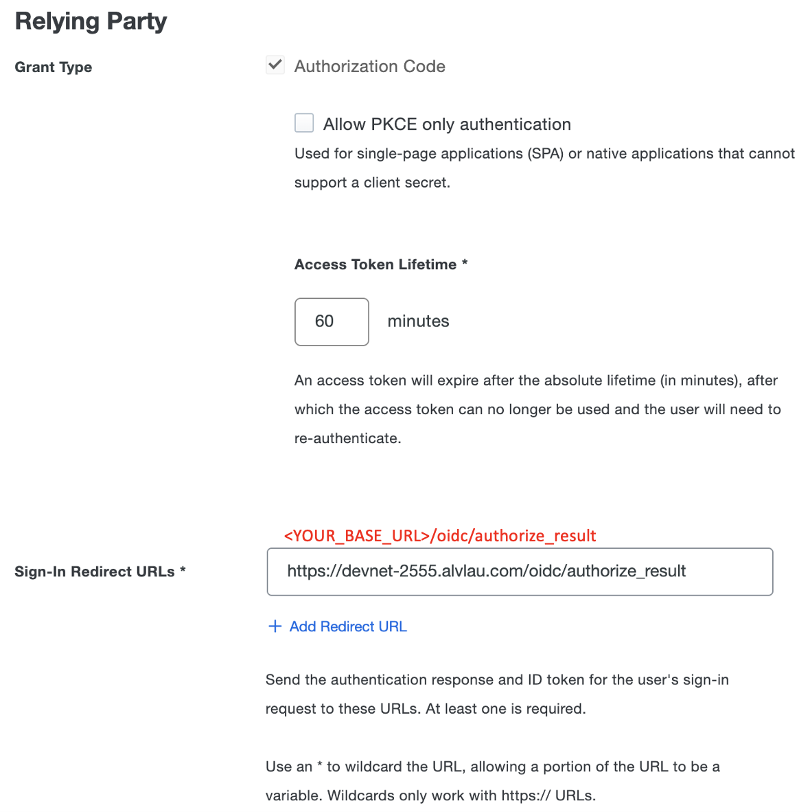

# Demo for Building Duo SSO Into Your Custom Application (DEVNET-2555)

This repository serves as the demo source code for Cisco Live Melbourne session DEVNET-2555 Building Duo SSO Into Your Custom Application. This code presents 3 scenarios where Duo customers can adopt in corporate Single Sign-On (SSO) strategies, namely Duo Web SDK (No SSO), SSO with SAML 2.0 and SSO with OIDC. You can test with any of them or run them simultaneously.


## Contacts
* Alvin Lau (alvlau@cisco.com)


## Prerequisite
- You have a Duo account with Essential license or above.
- You have set up Duo SSO. Refer to [this document](https://duo.com/docs/sso) for configuration guide.
- Your users are either created in Duo or sync-ed from authentication source. See [Duo User Administration Guide](https://duo.com/docs/administration-users).


## Installation

1. Clone this repository by `git clone https://github.com/lwy119/DEVNET-2555-Duo-SSO.git`.

2. Update the parameters in [.env](./env) file for Duo Web SDK, [saml/settings.json](./saml/settings.json) for SSO with SAML 2.0 and [oidc/settings.json](./oidc/settings.json) for SSO with OIDC. Detailed instruction in below sections.

3. Optionally, create a Python 3 virtual environment.
```
python3 -m venv venv
source venv/bin/activate
```

4. Install the dependencies: `pip install -r requirement.txt`

5. Run the application: `python app.py`

6. Access the application at http://localhost:8000.


## HTTPS Server
- Duo requires HTTPS endpoint for SSO callback. The above installation simply installs the code and runs the application in unprotected HTTP. To host the application in HTTPS, you can refer to Let's Encrypt [Certbot](https://certbot.eff.org/).


## Instruction for Duo Web SDK ([Offical Doc](https://duo.com/docs/duoweb))

1. Log in to the [Duo Admin Panel](https://admin.duosecurity.com/) and navigate to **Applications**.

2. Click **Protect an Application** and locate the 2FA-only entry for **Web SDK** in the applications list. Click **Protect** to the far-right to configure the application and get your **Client ID**, **Client secret**, and **API hostname**.

3. Put your **Client ID**, **Client secret**, and **API hostname** in [.env](./.env).


## Instruction for SSO with SAML 2.0 ([Offical Doc](https://duo.com/docs/sso-generic))

1. Log in to the [Duo Admin Panel](https://admin.duosecurity.com/) and navigate to **Applications**.

2. Click **Protect an Application** and locate the entry for **Generic SAML Service Provider** with a protection type of "2FA with SSO hosted by Duo (Single Sign-On)" in the applications list. Click **Protect** to the far-right to start configuring **Generic SAML Service Provider**.

3. Below are the mapping of **Generic SAML Service Provider** and [saml/settings.json](./saml/settings.json)


4. Remember to save the updates on **Generic SAML Service Provider**.


## Instruction for SSO with OIDC ([Offical Doc](https://duo.com/docs/sso-oidc-generic))

1. Log in to the [Duo Admin Panel](https://admin.duosecurity.com/) and navigate to **Applications**.

2. Click **Protect an Application** and locate the entry for **Generic OIDC Relying Party** with a protection type of "2FA with SSO hosted by Duo (Single Sign-On)" in the applications list. Click **Protect** to the far-right to start configuring **Generic OIDC Relying Party**.

3. Below are the mapping of **Generic OIDC Relying Party** and [oidc/settings.json](./oidc/settings.json)



4. Remember to save the updates on **Generic OIDC Relying Party**.


## License
Provided under Cisco Sample Code License, for details see [LICENSE](./LICENSE)


## Code of Conduct
Our code of conduct is available [here](./CODE_OF_CONDUCT.md)


## Contributing
See our contributing guidelines [here](./CONTRIBUTING.md)
